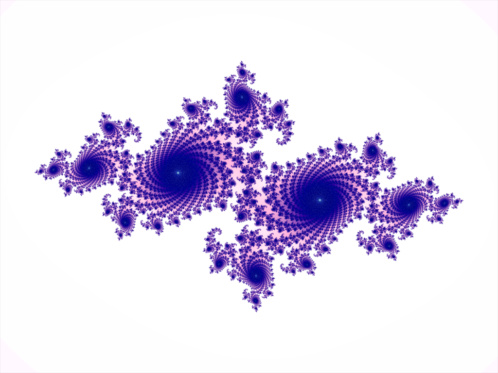

## Julia Fractals

### Background

A Julia set is a type of fractal. It is a set defined given a rational function (written J(f)). The Julia set consists of values such that an arbitrarily small perturbation can cause drastic changes in the sequence of iterated function values, known as chaotic behavior.

### Functionality & MVP

With this Julia fractal visualizer, users will be able to:

 - See a visualize rendering of a given Julia function
 - Interact with an input field that will change the rendered fractal

### Wireframes
