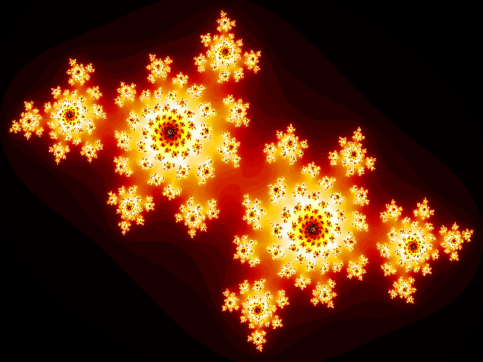

## Julia Fractals

### Background

A Julia set is a type of fractal. It is a set defined given a rational function (written J(f)). The Julia set consists of values such that an arbitrarily small perturbation can cause drastic changes in the sequence of iterated function values, known as chaotic behavior.

### The Math
Julia set fractals are normally generated by initializing a complex number  z = x + yi  where  i^2 = -1  and x and y are image pixel coordinates in the range of about -2 to 2. Then, z is repeatedly updated using:  z = z^2 + c  where c is another complex number that gives a specific Julia set. After numerous iterations, if the magnitude of z is less than 2 we say that pixel is in the Julia set and color it accordingly. Performing this calculation for a whole grid of pixels gives a fractal image.

The screen will be representing a part of the complex plane, inside the circle with radius 2 around the origin. For a pixel, the x coordinate will represent the real part of its complex coordinates, and the y coordinate will be the imaginary part.

For a julia set, for each pixel apply an iterated complex function. This function is newz = oldz² + c, with z and c both being complex numbers. Z is initially the coordinates of the pixel, and will then constantly be updated through every iteration: each iteration, the "newz" of the previous iteration is now used as "oldz".

If you keep iterating this function, depending on the initial condition (the pixel), z will either go to infinity, or remain in the circle with radius 2 around the origin of the complex plane forever. The points that remain in the circle forever, are the ones that belong to the Julia Set. So keep iterating the function until the distance of z to the origin (0,0) is greater than 2. Also give a maximum number of iterations, for example 256, or the computer would be stuck in an endless loop.

The color value of the pixel will then become the number of times we had to iterate the function before the distance of z to the origin got larger than 2. The constant c in the formula can be anything really, as long as it's also inside the circle with radius 2. Different values of c give different Julia Sets. Some Julia Sets are connected, others aren't.

### Functionality & MVP

With this Julia fractal visualizer, users will be able to:

 - See a visual rendering of a given Julia function
 - Interact with an input field that will change the rendered fractal

### Wireframes

This app will consist of a single screen with a canvas, a user input area, and nav links to my Github and LinkedIn.
Users will be able to change the constants of the fractal equation in order to generate different images in the canvas.
Initially, this will happen in a fixed input field.
As a bonus feature, I hope to implement constant rendering where constants are based on mouse position.

### Architecture and Technologies

This project will be implemented with the following technologies:

- React for site structure and rendering of non-canvas components
- `WebGL` for DOM manipulation and dynamic rendering of fractal set
- Redux for passing information from users to WebGL canvas
- Webpack to bundle and serve up the various scripts.

In addition to the webpack entry file, there will be one script that handles the fractal calculation and pixel rendering

### Implementation Timeline

**Phase 1**: Setup all necessary Node modules, including getting webpack up and running and `Easel.js` installed.  Create `webpack.config.js` as well as `package.json`.  Write a basic entry file.  Learn the basics of `Easel.js`.  Goals for the day:

- Get a green bundle with `webpack`
- Learn enough `Easel.js` to render an object to the `Canvas` element

**Phase 2**: Research math necessary to calculate a Julia set. Begin writing julia.js script.
Goal of this phase is to fully understand and internalize the math concepts needed to calculate this type of fractal
Goal: for the day:

- Create a 3x3 pixel Julia fractal in JavaScript

**Phase 3**: Learn the `Easel.js` API. Connect Julia logic to easel canvas. Scale up Julia calculation and aim to keep it efficient. Goal for the day:

- Render simple Julia set on screen

**Phase 4**: Install the controls for the user to interact with the game.  Style the frontend, making it polished and professional.  Goals for the day:

- Create controls for game speed, stop, start, reset, and shape type
- Have a styled `Canvas`, nice looking controls and title
- If time: Change input from fixed inputs to dependent on move position, allow for constant rendering as mouse moves

### Bonus Features

- Fractal set determined by mouse position
- Fractal updates constantly as mouse moves
- Refactor rendering using WebGL
